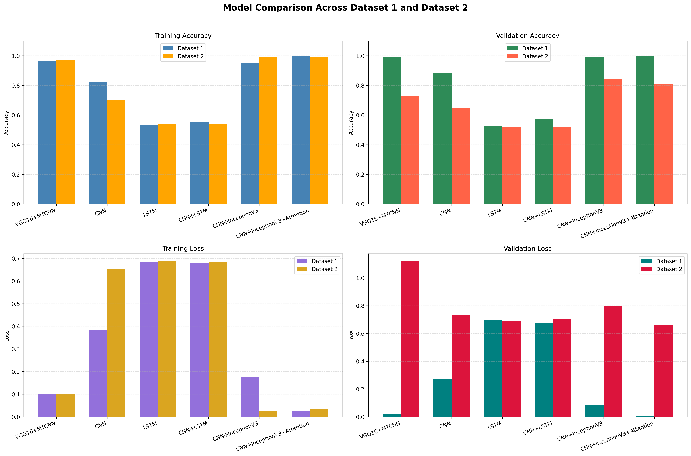
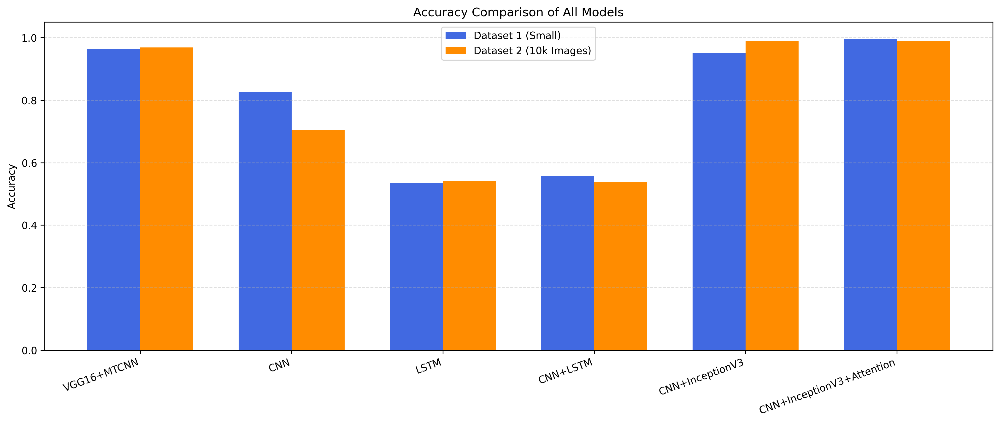
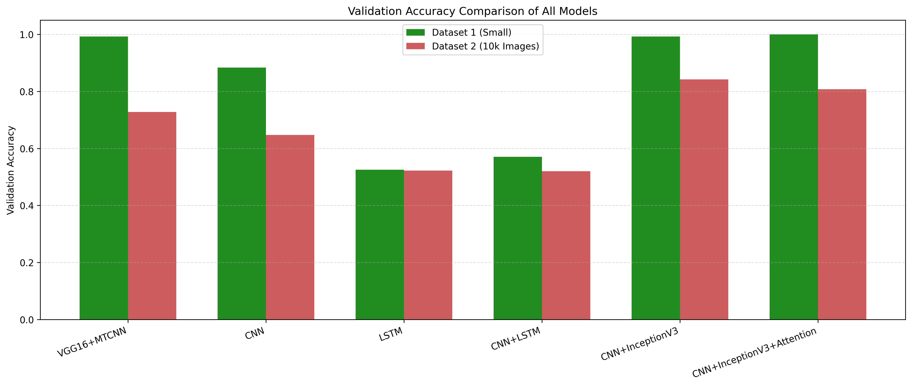

<div align="center">

# Deepfake Detection Comparison

[](https://www.python.org/)
[](https://jupyter.org/)
[]()
[]()

Comparative study of deep learning models for deepfake image detection across two datasets using transfer learning, hybrid architectures, and attention-based modeling.

</div>

---

## Best Model

> **Best overall performer:** `CNN + InceptionV3 + Attention`  
> Achieved the strongest results on Dataset 1 with **99.66% training accuracy** and **100.00% validation accuracy**, making it the top-performing architecture in this project.

---

## Table of Contents

- [Overview](#overview)
- [Project Highlights](#project-highlights)
- [Models Evaluated](#models-evaluated)
- [Dataset Summary](#dataset-summary)
- [Evaluation Metrics](#evaluation-metrics)
- [Performance Results](#performance-results)
- [Accuracy Comparison](#accuracy-comparison)
- [Visual Results](#visual-results)
- [Key Findings](#key-findings)
- [Repository Structure](#repository-structure)
- [Installation](#installation)
- [Usage](#usage)
- [Future Work](#future-work)
- [Author](#author)

---

## Overview

This project focuses on **binary deepfake image classification** using six different deep learning approaches. The objective is to compare their performance on two datasets of different scales and identify which architecture is most effective for deepfake detection.

The study includes:

- Transfer learning based models
- Hybrid CNN-LSTM architectures
- Attention-enhanced deep learning models
- Comparative analysis using accuracy and loss metrics
- Visual performance comparison across both datasets

---

## Project Highlights

- Comparative evaluation of **6 deep learning models**
- Experiments conducted on **2 datasets**
- Includes **accuracy, validation accuracy, loss, and validation loss**
- Visual comparison using saved result graphs
- Strong focus on identifying the best model for deepfake image classification

---

## Models Evaluated

| No. | Model |
|----|-------|
| 1 | VGG16 + MTCNN |
| 2 | CNN |
| 3 | LSTM |
| 4 | CNN + LSTM |
| 5 | CNN + InceptionV3 |
| 6 | CNN + InceptionV3 + Attention |

---

## Dataset Summary

| Dataset | Description | Details |
|--------|-------------|---------|
| Dataset 1 | Small dataset | Real: 1081, Fake: 960, Total: 2041 |
| Dataset 2 | Large dataset | Total images: 10,000 |

---

## Evaluation Metrics

The models were evaluated using:

- Training Accuracy
- Validation Accuracy
- Training Loss
- Validation Loss

---

## Performance Results

### Dataset 1

| Model | Accuracy | Loss | Val Accuracy | Val Loss |
|------|----------|------|--------------|----------|
| VGG16+MTCNN | 0.9647 | 0.1023 | 0.9924 | 0.0174 |
| CNN | 0.8251 | 0.3833 | 0.8838 | 0.2742 |
| LSTM | 0.5355 | 0.6858 | 0.5253 | 0.6971 |
| CNN+LSTM | 0.5566 | 0.6815 | 0.5707 | 0.6747 |
| CNN+InceptionV3 | 0.9520 | 0.1759 | 0.9924 | 0.0856 |
| CNN+InceptionV3+Attention | 0.9966 | 0.0265 | 1.0000 | 0.0077 |

### Dataset 2

| Model | Accuracy | Loss | Val Accuracy | Val Loss |
|------|----------|------|--------------|----------|
| VGG16+MTCNN | 0.9690 | 0.0997 | 0.7275 | 1.1169 |
| CNN | 0.7030 | 0.6527 | 0.6475 | 0.7328 |
| LSTM | 0.5420 | 0.6861 | 0.5225 | 0.6880 |
| CNN+LSTM | 0.5370 | 0.6828 | 0.5200 | 0.7025 |
| CNN+InceptionV3 | 0.9890 | 0.0260 | 0.8425 | 0.7977 |
| CNN+InceptionV3+Attention | 0.9900 | 0.0346 | 0.8075 | 0.6593 |

---

## Accuracy Comparison

| Model | Dataset 1 Accuracy | Dataset 2 Accuracy |
|------|--------------------|--------------------|
| VGG16+MTCNN | 0.9647 | 0.9690 |
| CNN | 0.8251 | 0.7030 |
| LSTM | 0.5355 | 0.5420 |
| CNN+LSTM | 0.5566 | 0.5370 |
| CNN+InceptionV3 | 0.9520 | 0.9890 |
| CNN+InceptionV3+Attention | 0.9966 | 0.9900 |

---

## Visual Results

### Model Comparison Across Dataset 1 and Dataset 2
Comparison of training accuracy, validation accuracy, training loss, and validation loss.



### Accuracy Comparison of All Models
Overall training accuracy comparison across both datasets.



### Validation Accuracy Comparison
Validation accuracy comparison to highlight generalization performance.



---

## Key Findings

- `CNN + InceptionV3 + Attention` achieved the best overall performance on Dataset 1.
- `CNN + InceptionV3` and `VGG16 + MTCNN` also showed strong results across the experiments.
- Transfer learning based architectures outperformed standard CNN and LSTM-based models.
- `LSTM` and `CNN + LSTM` were less effective for this image classification task.
- On Dataset 2, some models maintained strong training accuracy but lower validation accuracy, indicating overfitting.

---

## Repository Structure

```
deepfake-detection-comparison
├── .gitignore
├── README.md
├── Epics2.ipynb
├── epics1.ipynb
├── requirements.txt
└── images
    ├── model_comparison.png
    ├── accuracy_comparison.png
    └── validation_accuracy_comparison.png

```
---

## Installation

Clone the repository and move into the project directory:

```bash
git clone https://github.com/MAYANK479/deepfake-detection-comparison.git
cd deepfake-detection-comparison
pip install -r requirements.txt
```
---

Usage
Launch Jupyter Notebook:
```
jupyter notebook
```
Open and run:
```
Epics2.ipynb
```
---

 Future Work
 
	•	Add precision, recall, F1-score, and ROC-AUC comparisons
	•	Improve generalization using stronger data augmentation
	•	Convert notebook-based workflows into modular Python scripts
	•	Add model checkpoint tracking and experiment logging
	•	Deploy the best-performing model as a web application

---

 Author

Mayank Pandey
B.Tech CSE (AI & ML Specialization)

---
